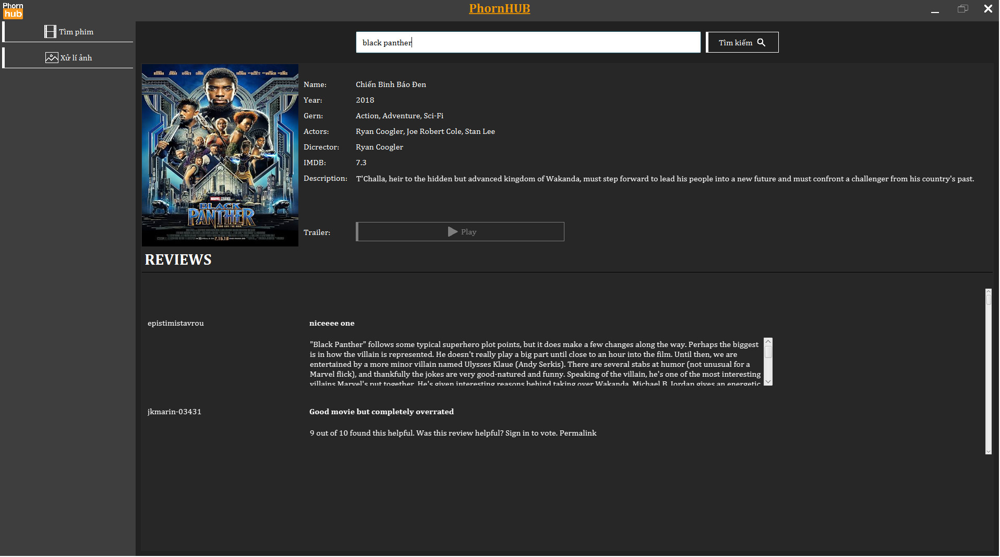
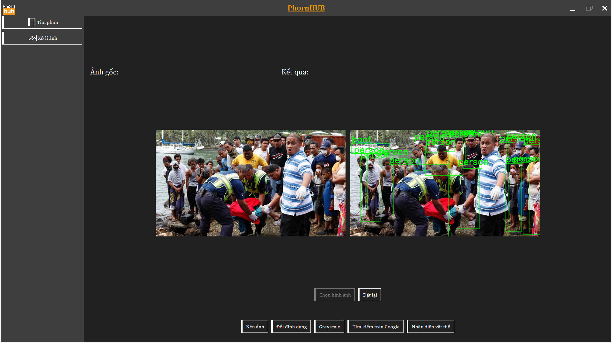
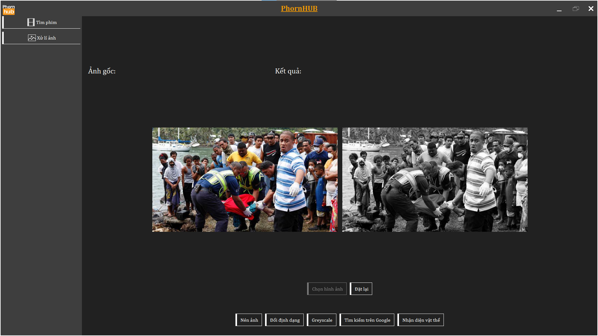

> [!IMPORTANT]
> THIS IS JUST A PROJECT FOR STUDYING PURPOSE

> [!CAUTION]
> The function **Watch Trailer** and **Find Similar Image from Google** are **NOT COMPLETE**
# Network Processing
### Description
  - This project is build for network processing learning base on client-server model
  - 2 mains function:
    - View detail of the film base on [IMDB](https://imdb.com)
    - Basic Image processing with opencv, yolo
  - Encrypt and Decrypt message tranfers between client and server with RSA, AES
### Technology
  - Java, JavaFx, OpenCv, Yolo
### UI
  - Search film
  

  - Image Detective
  

  - Image Grey_scale
  
### HOW TO RUN
  - Clone this project from github: ```git clone https://github.com/minhthuan26/Network-Processing.git```
  - Download yolov3.weights from [yolov3.weights](https://drive.google.com/drive/folders/1ctRkFZlSvGcqmBNvxizAEP3LqNUHolFO?usp=sharing) to **LTM-2022-server/src** folder
  - Extract **openjfx-22.0.1_windows-x64_bin-sdk.zip** from **lib** folder to receive **javafx-sdk-22.0.1** folder
  - Open 2 projects with Intellij IDE
  - From **LTM-2022-client** project, please Edit launch configuration => Add VM option: ```--module-path "<Path to javafx-sdk-22.0.1/lib>" --add-modules javafx.controls,javafx.fxml```
  - Start server **FIRST**: from **LTM-2022-server/src** run Server class
  - Start client **SECOND**: from **LTM-2022-client/src/main/java/com/ltm2022client/application** run Main class

